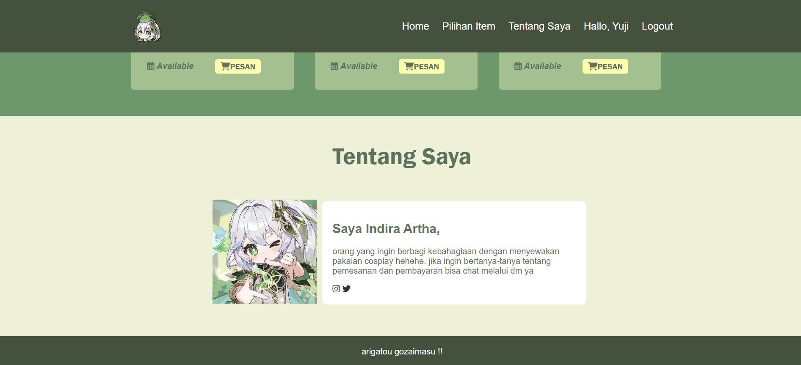
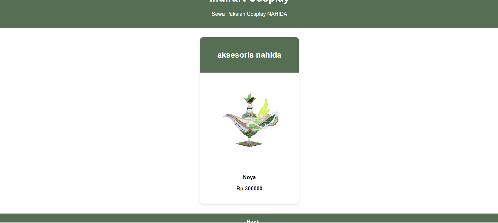

# Web Page Idea
Tema halaman ini adalah web sewa pakaian cosplay Nahida. Penggunanya adalah orang-orang yang tertarik dengan cosplay khususnya character Nahida. 
Pengalaman yang diharapkan dari pengguna saat mengakses halaman ini mungkin melibatkan beberapa aspek berikut:

1. **Navigasi yang Intuitif:** Pengguna dapat dengan mudah menavigasi halaman menggunakan antarmuka yang intuitif. Menu atau tautan yang jelas dapat membimbing mereka ke halaman-halaman terkait atau fitur-fitur yang mereka cari.

2. **Tampilan yang Menarik dan Bersih:** Desain halaman yang estetis dan bersih membantu menciptakan pengalaman pengguna yang positif. Pengguna dapat dengan mudah memahami struktur informasi dan fokus pada konten utama.

3. **Keterlibatan Konten yang Relevan:** Halaman menyediakan konten yang relevan dan bermanfaat sesuai dengan tujuan pengguna. Informasi yang disajikan jelas, mudah dipahami, dan memberikan nilai tambah.

4. **Responsif dan Cepat:** Halaman merespons dengan cepat terhadap interaksi pengguna, seperti klik atau masukan formulir. Pengguna mengharapkan pengalaman yang mulus tanpa waktu tunggu yang berlebihan.

5. **Keamanan dan Privasi:** Pengguna mengharapkan bahwa data pribadi mereka aman dan bahwa situs web ini mematuhi standar keamanan dan privasi yang berlaku.

6. **Fungsionalitas yang Tepat:** Setiap fitur atau fungsi di halaman berfungsi sesuai dengan harapan. Tidak ada bug atau masalah teknis yang menghambat pengalaman pengguna.

7. **Dukungan Responsif:** Jika ada formulir kontak atau saluran dukungan, pengguna mengharapkan tanggapan yang cepat dan membantu jika mereka memiliki pertanyaan atau masalah.

8. **Kemudahan dalam Tindakan:** Jika ada tindakan yang diharapkan dari pengguna (misalnya, mengisi formulir, melakukan pembelian, atau mendaftar), proses tersebut harus mudah dipahami dan diselesaikan.

Setiap pengguna mungkin memiliki harapan yang sedikit berbeda berdasarkan kebutuhan dan tujuan mereka, tetapi keseluruhan, pengalaman yang baik akan meningkatkan kepuasan pengguna dan kemungkinan kembali ke situs web tersebut.

# Dokumentasi Web

1) Pada halaman ini pengguna akan diberitahu tentang apa yang ada di dalam web tersebut

2) pada halaman ini pengguna akan diberitahu tentang informasi yang disediakan web seperti gambar item, deskripsi item, form pemesanan (klik button pesan)

3) pada halaman ini pengguna diberitahu tentang pemilik dari web sewa pakaian Nahida tersebut

4) pada halaman ini pengguna akan disuruh melakukan pengisian form pemesanan pakaian

berikut adalah tampilan web saat dibuka pada perangkat seluler

# DOKUMENTASI KODINGAN HTML

CSS dan JavaScript:
- Gaya untuk dokumen tersebut terdapat dalam file CSS eksternal: css/style.css.
- Logika JavaScript berada dalam file eksternal: js/main.js.

Navigasi:
- Menu navigasi mencakup tautan ke berbagai bagian halaman (Home, Pilihan Item, Tentang Saya).
- Juga mencakup menu hamburger untuk layar yang lebih kecil.

Bagian-Bagian:
- Bagian Header (#home):
  Menampilkan hero/jumbotron dengan judul, subjudul, dan tombol panggilan aksi.
- Bagian Pilihan Item (#pilihan-item):
  Memberikan tata letak grid untuk menampilkan item.
- Bagian Tentang Saya (#tentang-saya):
  Berisi informasi tentang pembuat dengan gambar dan tautan media sosial.
- Bagian Footer:
  Termasuk pesan penutup.

Sumber Daya Eksternal:
- Ikon diambil dari perpustakaan Ikon Phosphor dan Font Awesome.
- Perpustakaan JavaScript eksternal untuk fungsionalitas ikon.

# DOKUMENTASI KODINGAN CSS
1. Reset CSS
   - Mengatur margin dan padding ke nilai nol.
   - Menggunakan font 'Roboto' dan jenis sans-serif sebagai default.
   - Mengaktifkan perilaku scroll yang halus.
     
3. Wrapper Styling:
   - Membuat wrapper dengan lebar 1024px, rata tengah, dan padding.

5. Navigation Styling:
   - Menetapkan gaya untuk elemen navigasi.
   - Background berwarna hijau (#40513B), teks berwarna putih.
     
7. Menu Styling:
   - Mendesain menu navigasi dengan fleksibilitas dan tata letak.

9. Header Styling:
   - Mengatur latar belakang jumbotron dengan gambar dan efek bayangan teks.

11. Header Overlay Styling:
   - Menerapkan efek overlay pada bagian header untuk meningkatkan kontras.

11. Jumbotron Styling:
   - Mendesain jumbotron untuk menampilkan teks secara menengah.

11. Button Styling:
   - Mendesain tombol dengan efek hover dan transisi warna latar belakang.

11. Media Queries for Responsive Design:
    - Menyesuaikan tata letak dan gaya untuk ukuran layar yang lebih kecil menggunakan media queries.

13. Hamburger Menu Styling:
    - Mendesain tombol menu hamburger dengan efek hover.

# DOKUMENTASI KODINGAN JS
1. Memilih Elemen DOM:
   - Menggunakan document.querySelector untuk memilih elemen-elemen DOM berdasarkan kelas.

3. Menambahkan Event Listener:
   - Menambahkan event listener untuk meng-handle klik pada menu hamburger dan menu itu sendiri.
   - Memanggil fungsi displayMenu ketika terjadi klik.

5. Fungsi displayMenu:
   - Mengecek apakah menu memiliki kelas tampil. Jika ya, menghapusnya; jika tidak, menambahkannya.
   - Mengganti tampilan ikon antara hamburger dan close.

7. Definisi Kelas Item:
     - Membuat kelas Item dengan konstruktor yang menerima parameter untuk gambar, ukuran, denda, dan waktu pemesanan.
     - Memiliki metode showItem untuk menampilkan item dalam grid HTML dengan memanipulasi innerHTML dari elemen dengan id grid-item.
    
  9. Membuat dan Menampilkan Instansi Kelas Item:
     - Membuat tiga instansi dari kelas Item dengan berbagai parameter.
     - Memanggil metode showItem untuk menampilkan item dalam grid HTML.

# Penjelasan mengenai Desain Database :
1. class_barang menyimpan data tentang barang yang disewa, seperti ukuran barang, jenis barang, harga barang, dan stok barang.
2. class_pelanggan menyimpan data tentang pelanggan, seperti nama pelanggan, alamat pelanggan, nomor telepon pelanggan, dan email pelanggan.
3. class_transaksi menyimpan data tentang transaksi penyewaan, seperti tanggal sewa, tanggal kembali, jumlah hari, biaya sewa, dan status transaksi.
Pada gambar tersebut, hubungan antara ketiga tabel tersebut ditunjukkan dengan panah. Panah menunjukkan hubungan one-to-many.

Berikut adalah penjelasan singkat tentang masing-masing tabel:
1. tb_barang :
   - id_barang : Primary key untuk mengidentifikasi secara unik setiap barang.
   - jenis_barang : Jenis barang, seperti pakaian nahida, wig nahida, aksesoris nahida.
   - harga_barang : Harga barang.
   - ukuran_barang : Ukuran barang.
   - stok_barang : Stok barang yang tersedia.

2. tb_pelanggan
   - id_pelanggan : Primary key untuk mengidentifikasi secara unik setiap pelanggan.
   - nama_pelanggan : Nama pelanggan.
   - alamat : Alamat pelanggan.
   - nomor_telepon : Nomor telepon pelanggan.
   - email : Email pelanggan.
     
3. tb_transaksi
   - id_transaksi : Primary key untuk mengidentifikasi secara unik setiap transaksi penyewaan.
   - id_pelanggan : Foreign key yang merujuk ke primary key dari tabel pelanggan.
   - id_barang : Foreign key yang merujuk ke primary key dari tabel barang.
   - tanggal_sewa : Tanggal saat transaksi penyewaan dimulai.
   - tanggal_kembali : Tanggal saat transaksi penyewaan berakhir.
   - jumlah_hari : Jumlah hari barang disewa.
   - status_transaksi : Status transaksi, seperti "Menunggu Pembayaran", "Penyewaan", atau "Dikembalikan".

# Penjelasan Tech Stack
Stack teknologi yang digunakan dalam web yaitu
1. Front-End
   - HTML digunakan untuk membuat struktur dan konten halaman web
   - CSS untuk memberikan tata letak, gaya, dan desain visual pada elemen-elemen HTML
   - JavaScript untuk memberikan interaktivitas pada sisi klien (frontend). Beberapa skrip JavaScript ditempatkan dalam file barang.js, main.js, pesanan.js, dan respon.js. Ini termasuk logika untuk menampilkan item, menghitung harga, dan mengelola tampilan responsif.
   - Font Awesome untuk ikon
   - Phosphor Icons untuk ikon tambahan
2. Back-end
   - PHP untuk mengelola sisi server (backend). contohnya file index.php mencakup logika PHP untuk menangani pengaturan sesi, pengambilan data barang dari database, dan menampilkan item pada halaman web. File functions.php berisi fungsi-fungsi PHP untuk query ke database dan registrasi pengguna (pelanggan dan admin).
3. Database
   - MySQL digunakan sebagai sistem manajemen basis data (RDBMS).

# Penjelasan instruksi konfigurasi
   1. Buka file dbconfig.php
   2. Atur nilai variabel $host, $user, $password, dan $database sesuai dengan informasi koneksi database MySQL. Pastikan informasi ini sesuai dengan pengaturan server MySQL
   3. Pastikan untuk memeriksa dan menyesuaikan logika otentikasi pada "auth.php". Pastikan fungsi login, logout, dan lainnya bekerja dengan benar sesuai kebijakan keamanan yang diinginkan
   4. Eksekusi skrip SQL "indirart_cosplay.sql" di server MySQL untuk membuat database dan tabel yang diperlukan. Bisa dilakukan melalui phpMyAdmin atau terminal MySQL.
   5. Pastikan semua file yang terlibat dalam aplikasi ini berada di server web PHP yang sesuai.
   6. Pastikan izin file dan folder sudah diatur dengan benar agar PHP dapat membaca dan menulis file jika diperlukan.

# Penjelasan Intruksi Penggunaan Web
PELANGGAN : 
1. saat memasuki web, pelanggan akan ditampilkan halaman home
   
2. pelanggan diwajibkan untuk melakukan log in sebelum memesan barang (KLIK TOMBOL LOG IN)
   
   jika belum memiliki akun, pelanggan bisa melakukan registrasi dengan cara klik link "registrasi disini"
   
   pastikan pelanggan mengisi data dengan benar. setelah mengisi data klik register lalu kembali ke halaman log in dan memasukan email dan password yang sudah didaftarkan
3. Setelah log in, pelanggan akan ditampilkan halaman home lagi.
   
   untuk melihat barang yang disewa, pelangan bisa klik tombol "pesan sekarang" atau scroll kebawah.
   
4. setelah pelanggan sudah tau barang yang mau dibeli, pelanggan tinggal klik tombol "pesan" yang sudah disediakan disetiap daftar item
5. setelah klik tombol "pesan", pelanggan akan ditampilkan halaman form pemesanan. pastikan pelanggan mengisi data benar dan sesuai keinginan. setelah selesai memesan klik tombol "sewa sekarang"
   
6. setelah melakukan pemesanan sudah berhasil, pelanggan bisa kembali ke halaman home dan membaca "tentang saya" untuk membaca mengenai pemesanan dan pembayaran
   

ADMIN :
Penggunaan web untuk admin sama persis seperti penggunaan pada pelanggan
1. admin wajib melakukan log in terlebih dahulu
   
   jika belum punya akun, admin bisa melakukan registrasi terlebih dahulu dengan cara klik link "registrasi disini"
   
   pastikan data diisi dengan benar. setelah melakukan registrasi, admin kembali ke halaman log in untuk melakukan log in dengan data yang sudah diisi pada registrasi
2. setelah log in, admin akan ditampilkan ahalam daftar barang sewa yang sudah dipesan pelanggan
   
   untuk melihat pemilik barang yang disewa dan detail barang yang dibeli, admin klik link view yang berada paling kanan
   